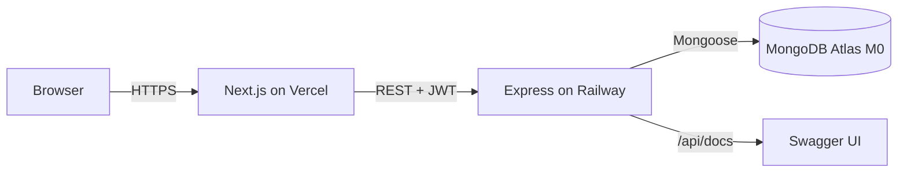
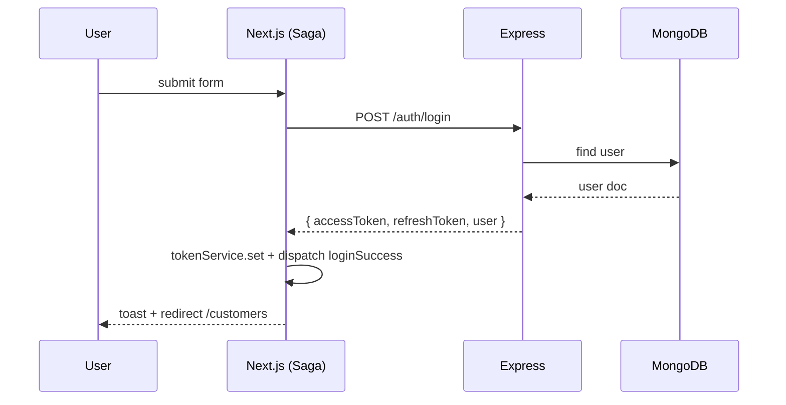

# Phase 08 — Documentation + Polish

**Goal:** Ship-quality READMEs, env templates, screenshots, and small UX/quality polish that make the project look like a real-world repo a recruiter can clone, run, and understand in under 10 minutes.

---

## Working dir: `/Users/bac/Desktop/Dev/customers/`

---

## Files to create / update

```
customers/
├── README.md                        # TOP-LEVEL — feature highlights, demo, quickstart
├── .github/
│   ├── PULL_REQUEST_TEMPLATE.md
│   └── ISSUE_TEMPLATE/
│       ├── bug_report.md
│       └── feature_request.md
├── docs/
│   ├── architecture.md              # diagrams, data flow
│   ├── api.md                       # generated or hand-written API reference
│   ├── decisions/                   # ADRs
│   │   ├── 0001-stack-choice.md
│   │   ├── 0002-auth-refresh-rotation.md
│   │   └── 0003-redux-saga-vs-rtk-query.md
│   ├── screenshots/
│   │   ├── login.png
│   │   ├── customers-list.png
│   │   ├── customer-detail.png
│   │   ├── customer-form.png
│   │   └── swagger.png
│   └── runbook.md                   # ops: how to seed, how to rollback, etc.
│
├── back-end/README.md               # BE-specific
└── front-end/README.md              # FE-specific
```

---

## Top-level `README.md` outline

```md
# Customer Management

Polished full-stack CRUD app for managing customers and their identity documents.

- **Live demo:** https://customers-frontend.vercel.app
- **API docs:** https://customers-api.up.railway.app/api/docs
- **Stack:** Next.js 14 · Redux Toolkit + Saga · Antd 5 · Express · Mongoose · MongoDB Atlas

## Features
- JWT auth with refresh rotation
- Paginated, searchable, sortable customer list
- Multi-document support per customer (CCCD, Driver License, Passport) with one-per-type rule
- Server-side validation, centralized error handling, rate limiting
- Swagger API docs

## Screenshots
(gif or 4-6 images)

## Tech choices
(short paragraph per layer + link to docs/decisions/0001-stack-choice.md)

## Quickstart (local)
\`\`\`bash
# 1. clone
git clone https://github.com/<you>/customers.git
cd customers

# 2. backend
cd back-end
cp .env.example .env       # fill in MONGODB_URI, JWT secrets
npm install
npm run seed              # creates admin user + 25 sample customers
npm run dev               # → http://localhost:4000

# 3. frontend (new terminal)
cd front-end
cp .env.example .env.local # set NEXT_PUBLIC_API_BASE_URL
npm install
npm run dev               # → http://localhost:3000
\`\`\`

Login: `admin@example.com` / `Admin@123`

## Project structure
(see plan.md folder tree)

## API
See `docs/api.md` or live Swagger at `/api/docs`.

## Deployment
See `docs/decisions/...` and `plans/customer-management-app/phase-07-deployment.md`.

## License
MIT
```

---

## `back-end/README.md` outline

Sections:
- **Stack & rationale** (Express + Mongoose + Zod + JWT).
- **Folder structure** with one-line per folder purpose.
- **Local setup** (env vars table, `npm run dev`, `npm test`, `npm run seed`).
- **Scripts** table (`dev`, `build`, `start`, `lint`, `typecheck`, `test`, `seed`).
- **Environment variables** table.
- **Architecture diagram** (controller → service → repository → model).
- **Auth flow** (login, refresh rotation, logout).
- **Error contract** (`{ success, error: { code, message, details } }`).
- **API reference** pointer to Swagger.
- **Testing** approach (Jest + supertest + mongodb-memory-server).
- **Deployment** pointer to Railway section.

---

## `front-end/README.md` outline

Sections:
- **Stack & rationale** (Next.js 14 App Router, Redux Toolkit + Saga, Antd 5, RHF + Zod).
- **Folder structure**.
- **Local setup** (env vars, `npm run dev`).
- **Scripts** table.
- **Environment variables**.
- **Theming** (Antd tokens — link to `lib/theme.ts`).
- **State management** (slices + sagas flow diagram).
- **Forms** (RHF + Zod, why we don't use Antd Form).
- **Auth flow** (login → persist → route guard → refresh on 401).
- **Build & deploy** (Vercel).
- **Performance notes** (`optimizePackageImports`, image domains, font loading).

---

## Architecture doc (`docs/architecture.md`)

ASCII / Mermaid diagrams:



Request flow (login):


Data model: include the Mongoose schemas (text) and an ER diagram.

---

## ADRs (Architecture Decision Records)

Use the "MADR" template (Markdown Any Decision Record). Short, ~30 lines each.

### `0001-stack-choice.md`
- **Status:** Accepted
- **Context:** Need a recruiter-impressive stack that demonstrates modern patterns.
- **Decision:** Next.js 14 (App Router) + Redux Toolkit + Saga + Antd 5 on FE; Express + Mongoose on BE; MongoDB Atlas.
- **Consequences:** Slightly heavier than Next-only; gain in: clean separation, recruiter readability, easy backend reuse.
- **Alternatives considered:** NestJS (over-engineered for this), RTK Query instead of Saga (recruiter asked for Saga explicitly).

### `0002-auth-refresh-rotation.md`
- **Status:** Accepted
- **Context:** Long sessions require refresh tokens.
- **Decision:** Short-lived access (15m) + long-lived refresh (7d). Refresh tokens are stored hashed in DB and rotated on every use.
- **Consequences:** DB writes on every refresh; revoked tokens are unusable.

### `0003-redux-saga-vs-rtk-query.md`
- **Status:** Accepted
- **Context:** Recruiter spec requires Redux Saga for API calls.
- **Decision:** Use RTK for state, Saga for side effects. RTK Query considered; rejected because Saga is the explicit requirement and demonstrates async orchestration skills.
- **Consequences:** More boilerplate than RTK Query; better control over complex flows (refresh + retry, debounced search).

---

## Runbook (`docs/runbook.md`)

Cheat-sheet for ops:
- How to seed: `npm --prefix back-end run seed`
- How to rotate JWT secrets: edit Railway env vars → redeploy → all users must re-login.
- How to view logs: Railway → service → Logs; Vercel → Deployments → Logs.
- How to rollback: see phase 7.
- How to add a new env var: edit `.env.example` + Vercel + Railway, redeploy.
- Common errors table (e.g. "MongooseServerSelectionError: ..." → check `MONGODB_URI` + Atlas network access).

---

## Screenshots

Capture from the deployed app (or local if not deployed yet):
- Login page (light, centered card)
- Customers list (table with seeded data, filter bar, pagination)
- Customer detail (descriptions + docs list)
- Customer form (sections collapsed / expanded)
- Swagger UI (show all endpoints)

Add them to `docs/screenshots/` and reference in top-level README.

---

## Polish pass checklist

### Backend
- [ ] All controllers return consistent `ApiResponse` shape.
- [ ] No `console.log` left; use logger.
- [ ] All errors logged with `requestId`.
- [ ] `npm run lint` + `npm run typecheck` + `npm test` all pass.
- [ ] No `TODO` left in code.
- [ ] `.env.example` is up to date.
- [ ] Swagger UI shows every endpoint + schemas.

### Frontend
- [ ] Lighthouse score > 90 (Performance, Accessibility, Best Practices) on the list page.
- [ ] No console warnings in production build.
- [ ] No `any` types in `features/`.
- [ ] All forms have visible validation.
- [ ] Loading and error states everywhere.
- [ ] `next/image` for any image we add.
- [ ] `next/font` for Inter.
- [ ] `metadata` for title/description on every page (or via root layout).
- [ ] `robots.txt` and `sitemap.xml` (optional polish — generate with `next-sitemap`).

### Repo
- [ ] `.github` PR + issue templates.
- [ ] `LICENSE` (MIT).
- [ ] Top-level `CHANGELOG.md` (v0.1.0 initial release).
- [ ] No `node_modules`, `.env`, or build artifacts committed.
- [ ] Branch `main` is clean; tagged `v0.1.0`.

---

## Validation

- [ ] Fresh clone on a colleague's machine → `npm install && npm run seed && npm run dev` works in 5 min.
- [ ] README "Quickstart" is copy-paste runnable.
- [ ] All links in docs resolve.
- [ ] Screenshots render in README on GitHub.
- [ ] No dead code, no unused exports.
- [ ] Recruiter can navigate the repo without asking you a question.

---

## Notes

- Polish is the difference between "junior dev did a tutorial" and "senior dev shipped a real thing". Spend the time.
- A clean `architecture.md` + 3 ADRs is worth more than 20 hours of feature creep.
- Consider a short Loom / GIF walkthrough of the app in `docs/demo.gif` — recruiters love it.
